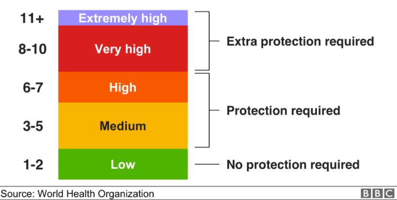
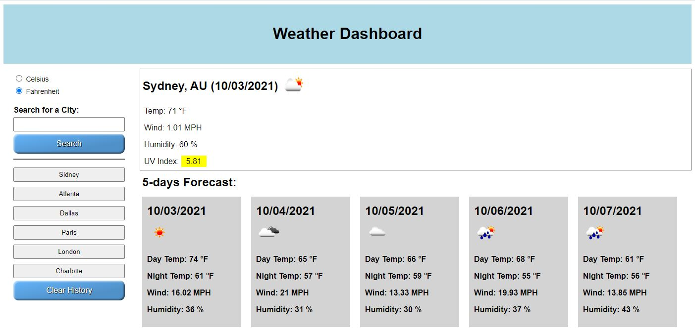

# Weather-Dashboard
When you search for a city weather, then it will show current and future conditions for that city and that city is added to the search history.

Weather information for current day:

City name, country code current city date, and icon of weather conditions.

The temperature, the humidity, the wind speed, and the UV index.

UV index presented with a color that indicates whether the conditions.

Ten bellow is a 5-day forecast that displays the date, an icon representation of weather conditions, the day and night temperature, the wind speed, and the humidity.

When you click on a city in the search history, then it again will show current and future conditions for that city.

You can choose in what system to show (metric or imperial).

For search you will need to enter a city name and press search button or press enter button on keyboard.

The last search in the history will be the top one.

If it can’t find the entered city, the message appears on the screen “No City Found”.

In the history it will always show city name with the first uppercase letter, no matter how customer will enter it.

## Link to website
https://juliusm9791.github.io/Weather-Dashboard/

## Mock-Up
The following images shows the web application's appearance and functionality:

© 2021 Julius Markauskas